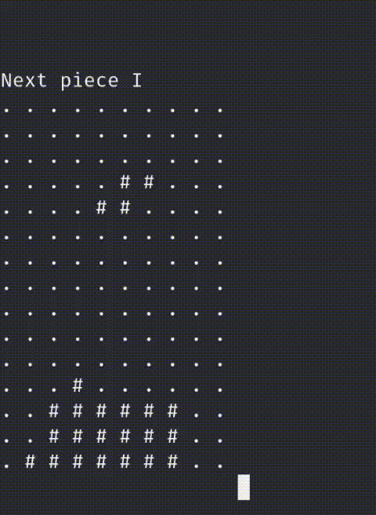

# Tetris CLI

Play a Tetris clone directly on your terminal!

Made entirely in **Rust**.



(Tested on Zsh and Bash in Linux)

## How to play

- Move the piece to the left: `a`
- Move the piece to the right: `d`
- Rotate the piece: `l`
- Drop the piece: `s`
- Quit the game: `q`

## Setup

### Option 1 - Using the binary

1. Download the binary from the [releases page](https://github.com/yantavares/tetris-cli/releases)

OR

1. Clone the repository and enter the directory

```bash
git clone https://github.com/yantavares/tetris-cli.git
cd tetris-cli/bin
```

2. Run the game

```bash
chomd +x tetris-cli

./tetris-cli
```

### Option 2 - Using Cargo

0. Install Rust and Cargo

1. Clone the repository and enter the directory

```bash
git clone https://github.com/yantavares/tetris-cli.git
cd tetris-cli
```

2. Run the game

```bash
cargo run
```

Thank you for playing!
